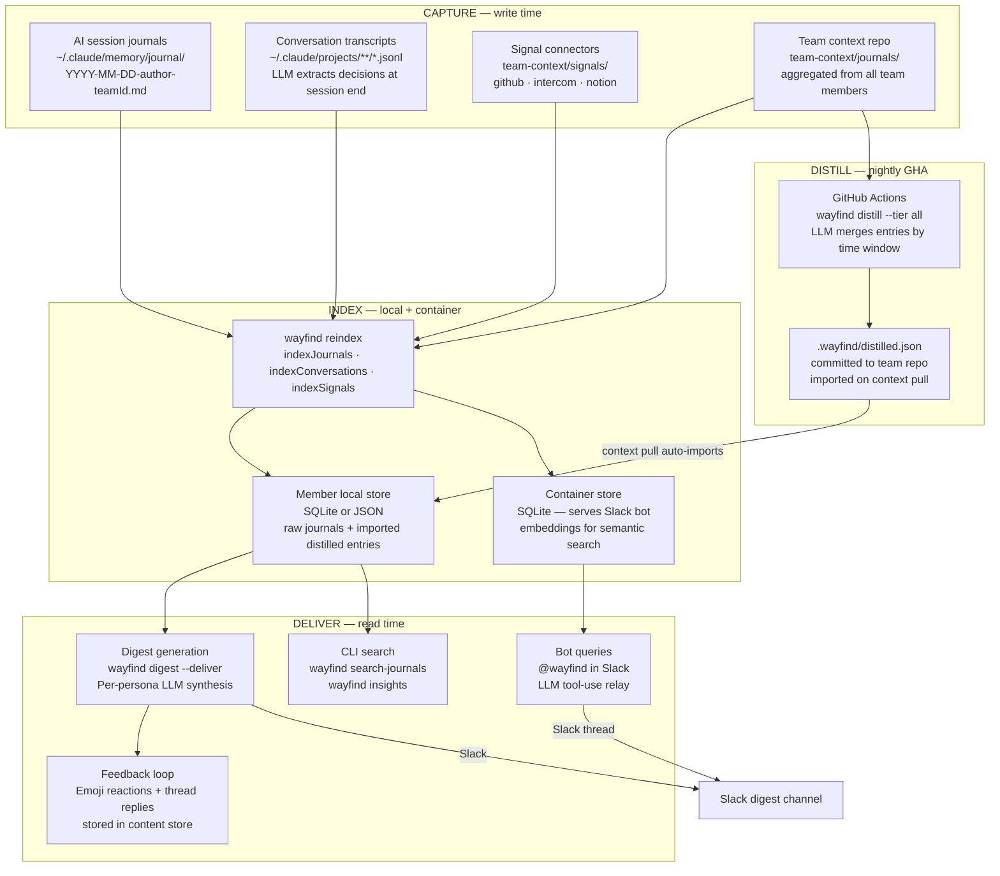
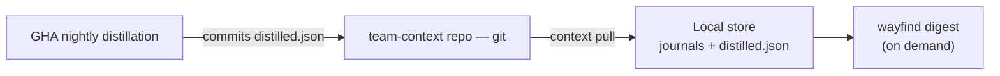
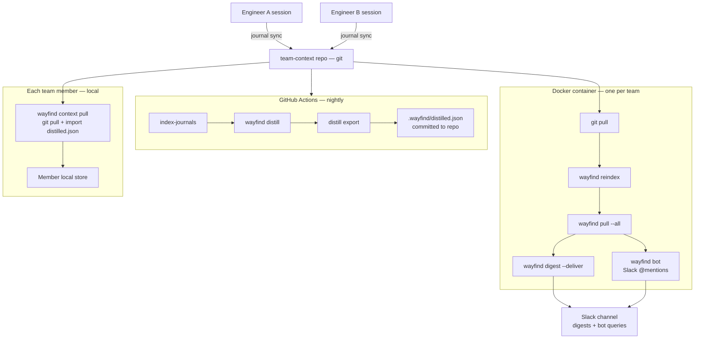
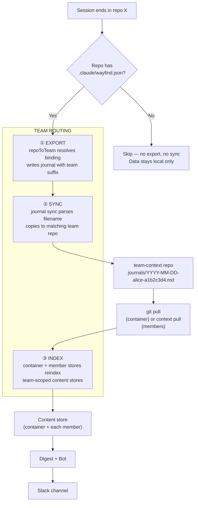

# Data Flow

How data moves through Wayfind — from raw engineering activity to actionable team digests and bot answers.

---

## The Big Picture

Wayfind has three phases: **capture**, **distill**, and **deliver**. Data enters as plain markdown files written during AI coding sessions and pulled from external tools. It gets indexed into a searchable content store, optionally distilled by LLM into higher-level summaries, and leaves as persona-targeted digests and bot responses.

Everything is scoped to a **team**. A repo must be bound to a team via `wayfind init-memory` to participate. Unbound repos are invisible to Wayfind — no export, no sync, no digest.



---

## Phase 1: Capture

Data enters Wayfind from four sources, all as plain markdown files. No databases, no proprietary formats.

### Session journals (primary source)

Engineers use AI coding assistants (Claude Code, Cursor, etc.) with Wayfind's session protocol. At session end, the AI writes a journal entry:

```markdown
## backend-api — Fix auth token refresh race condition
**Author:** alice
**Why:** Users seeing intermittent 401s after token expiry
**What:** Added mutex around token refresh, fixed retry logic
**Outcome:** No more 401 cascades in staging
**On track?:** Focused
**Lessons:** Token refresh needs to be atomic, not just async
```

Journals are named `YYYY-MM-DD-<author>-<teamId>.md` in `~/.claude/memory/journal/`. The filename carries both author attribution and team routing.

**How it gets there:** The AI writes it during the session-end protocol. No manual steps.

### Conversation transcripts (automatic extraction)

Claude Code stores conversation transcripts as `.jsonl` files in `~/.claude/projects/`. At session end, the stop hook runs:

```
wayfind reindex --conversations-only --export
```

This sends each transcript to a lightweight LLM for decision extraction. Extracted decisions are written as journal entries (with team suffix) for git sync. The extraction is parallelized (max 5 concurrent LLM calls) and incremental (skips unchanged transcripts via content hashing).

**Why this matters:** Engineers don't always write perfect journal entries. Conversation extraction captures decisions that were discussed but might not have made it into the explicit journal.

### Signal connectors (external data)

`wayfind pull <channel>` polls external APIs and writes markdown:

| Channel | What it captures | Output location |
|---------|-----------------|----------------|
| GitHub | Issues, PRs, Actions status | `signals/github/<owner>/<repo>/YYYY-MM-DD.md` |
| Intercom | Conversation stats, tags, response times | `signals/intercom/YYYY-MM-DD.md` |
| Notion | Recently updated pages, database entries, comments | `signals/notion/YYYY-MM-DD.md` |

Each channel also produces a `*-summary.md` rollup. The digest prefers rollups over per-repo files to manage token budget.

Connectors follow a standard interface: `configure()`, `pull(since)`, `summarize()`. Adding a new channel means implementing this contract.

**Signals are configured per team.** Each team's `connectors.json` defines which GitHub orgs, Intercom workspaces, and Notion databases to pull from. The container reads signal config from its team's connectors, so different teams get different external data.

**How it gets there:** `wayfind pull --all` on cron, or manual `wayfind pull github`. In the Docker deployment, the container runs signals on its team's configured schedule.

### Team context repo (multi-engineer aggregation)

For teams with multiple engineers, `wayfind journal sync` copies authored journals from each engineer's local `~/.claude/memory/journal/` to a shared Git repo (`team-context/journals/`). The sync command:

1. Reads the team suffix from each journal filename
2. Copies files to the matching team's context repo
3. `git add` + `git commit` + `git push` (with rebase retry on conflict)
4. **Skips unsuffixed files** — only explicitly team-tagged journals are synced

The Docker container mounts this repo and runs `git pull` before each reindex cycle, so it sees all team members' journals.

---

## Phase 2: Index

`wayfind reindex` builds a unified content store from all sources. It runs three indexers sequentially:

1. **`indexJournals()`** — Parses `*.md` files from the journal directory. Extracts structured fields (Why, What, Outcome, Lessons, drift status). Detects author from filename slug, inline marker, or file-level marker (three-tier fallback). Computes content hash per entry for incremental updates.

2. **`indexConversations()`** — Scans `.jsonl` transcript files. Sends each to LLM for decision extraction. Tracks processed files in `conversation-index.json` so re-runs skip unchanged transcripts.

3. **`indexSignals()`** — Indexes markdown from `signals/` subdirectories. Tags entries with channel name and section headings.

All three write to the same content store — a single unified index regardless of source. Each entry carries a `source` field (`journal`, `conversation`, `signal`, or `distilled`) so the query layer can distinguish them when needed. The backend is SQLite when `better-sqlite3` is available, with JSON file fallback.

**Embeddings** are generated if `OPENAI_API_KEY`, `AZURE_OPENAI_EMBEDDING_*`, or a local embedding model (`@xenova/transformers`) is configured. Stored alongside the index. Backfilled on re-index for entries that were previously indexed without them.

The index is **incremental**. Content hashing means running `wayfind reindex` twice on the same data produces zero updates. This matters for the container cron — most cycles complete in seconds.

### Three stores, one architecture

There are three distinct content stores, each serving a different role:

| Store | Where | What it contains | Who reads it |
|-------|-------|-----------------|-------------|
| **Member local store** | `~/.claude/team-context/content-store` (per member) | Raw journals + conversation extracts + distilled entries | `wayfind digest`, `wayfind search-journals`, CLI tools |
| **Container store** | Docker container, persisted volume | Same raw content + full embeddings | Slack bot (real-time semantic search) |
| **Ephemeral GHA store** | GitHub Actions workspace | Rebuilt from scratch each distillation run | `wayfind distill` only — discarded after export |

The container store needs its own copy because it must serve real-time semantic search with embeddings. The member local stores generate their own local embeddings (Xenova by default) — when embeddings aren't available, search falls back to date-sorted browse.

---

## Phase 2.5: Distill (GHA pipeline)

Distillation compresses old journal entries into higher-level summaries using LLM merging. It runs nightly via GitHub Actions — not in the container, not locally.

```
wayfind distill --tier all
```

Three tiers, each covering a different time window:

| Tier | Age range | What it produces |
|------|-----------|-----------------|
| `daily` | 3–14 days old | Recent decisions grouped by theme |
| `weekly` | 14–60 days old | Weekly rollups of patterns and outcomes |
| `archive` | 60+ days old | Long-term architectural decisions and lessons |

**Why GHA, not the container?** Distillation is expensive (many LLM calls) and benefits all team members, not just the machine running the bot. Running it in GHA means:
- All team members get distilled content, not just the bot owner
- No container required for PLG/trial users
- No livelock from journal pushes cancelling in-progress distillation runs
- Schedule is predictable (2am UTC nightly) rather than tied to container uptime

**How members receive distilled content:**

1. GHA runs `wayfind distill export --output .wayfind/distilled.json`
2. Commits `distilled.json` to the team repo with `[skip ci]`
3. On next `wayfind context pull`, each member's client auto-imports new distilled entries (idempotent by content hash — no re-embedding of already-seen entries)

---

## Phase 3: Deliver

Three output paths, all reading from the same content store.

### Digest generation

`wayfind digest` generates persona-targeted summaries:

1. **Collect** — Queries the content store for entries in the date range. Separates journals/conversations from signals. Falls back to raw file scan if the store isn't indexed yet.
2. **Budget** — Applies a token budget (default 120K chars). Signals get 30% of budget, journals get 70%. Truncates from oldest first.
3. **Generate** — For each persona (Engineering, Product, Design, Strategy), sends the collected data + a persona-specific prompt to the LLM. Each persona gets a different lens on the same underlying data.
4. **Deliver** — `--deliver` posts to Slack via bot token (`chat.postMessage`). Falls back to incoming webhook. Adds a threaded follow-up asking for feedback.

Generated digests are written to disk (`~/.claude/team-context/digests/`) as JSON payloads for audit and replay. The content store tracks delivery metadata (timestamp, channel, persona) and feedback.

### Bot queries

The Slack bot (`wayfind bot`) receives @mentions via Socket Mode. It uses an LLM tool-use relay — the same tools as MCP clients:

1. **Relay** — Hands the user's question to Claude (Haiku) with `search_context` and `get_entry` as available tools, plus thread history (up to 5 prior turns).
2. **Tool use** — Claude decides how to search: calls `search_context` with appropriate filters (`since`, `until`, `user`, `source`, `mode`), then `get_entry` for promising results. May run multiple searches.
3. **Synthesize** — Claude synthesizes an answer from the retrieved entries.
4. **Reply** — Posts the answer as a Slack thread reply. Supports multi-turn conversation within the thread.

### CLI search

`wayfind search-journals <query>` and `wayfind insights` read directly from the content store. Semantic search uses local Xenova embeddings by default (no API key needed). When embeddings aren't available, search falls back to date-sorted browse.

### Feedback loop

After digest delivery, the bot tracks:
- Emoji reactions on the digest message (via `reaction_added`/`reaction_removed` events)
- Text replies in the digest thread
- Stored in the content store's feedback table

`wayfind digest scores` surfaces this data. The feedback eventually informs digest quality tuning.

---

## Deployment Topologies

### CLI-only (PLG / trial)

No container. Team members use `wayfind context pull` to sync journals and distilled entries. Digests run on-demand from the CLI.



This is the default experience for PLG users and trial teams. Distillation works via GHA with no machine always-on. Bot and Slack delivery require the Docker container.

### GHA + CLI (team, no bot)

Same as CLI-only, but the team has set up the distillation workflow in their GitHub repo. All team members automatically receive distilled entries on each `context pull`. No container required.

### Team (Docker self-hosted)

**One container per team.** Each container runs bot + scheduler + auto-indexer for a single team. It mounts that team's context repo and reads that team's signal config and schedules.

If an engineer belongs to multiple teams, their machine runs multiple containers — one per team. Each container has its own `TEAM_CONTEXT_TENANT_ID`, Slack channel, signal connectors, and cron schedules.



**Container vs GHA ownership:**
- Container: bot queries, digest delivery, signal pulls, reindex (raw journals only)
- GHA: distillation (LLM merging) — runs nightly, commits results back to repo
- Members: receive raw journals via `git pull` + distilled entries via `importDistilled` on `context pull`

---

## Multi-Team Routing

When an engineer works across multiple teams (e.g., work repos + personal side projects), Wayfind must route journal entries to the correct team's context repo. Without this, personal project decisions leak into team digests.

### Team boundary model

Repos **opt in** to a team. Running `wayfind init-memory` in a repo creates `.claude/wayfind.json` with the team binding:

```json
{ "team_id": "a1b2c3d4" }
```

Repos without this file are **invisible to Wayfind** — their sessions are not exported, not synced, and do not appear in any digest. This is the correct default: data stays local until explicitly shared.

The team registry lives at `~/.claude/team-context/context.json`:

```json
{
  "teams": {
    "a1b2c3d4": { "path": "~/repos/acme/team-context", "name": "Acme Engineering" },
    "personal": { "path": "~/repos/personal/team-context", "name": "personal" }
  }
}
```

### Where team routing happens

Team routing decisions occur at **three points** in the data flow. Each must correctly resolve repo → team, or data leaks across boundaries.



### Routing decision details

| # | Stage | Input | Decision logic | Output | Failure mode |
|---|-------|-------|---------------|--------|-------------|
| ① | **Export** | Repo name from conversation transcript | `buildRepoToTeamResolver()` scans `~/repos/**/.claude/wayfind.json` to build repo→team map | Journal filename includes team suffix: `YYYY-MM-DD-alice-a1b2c3d4.md` | **Unbound repo → null.** No journal written for this repo. |
| ② | **Sync** | Journal filename | Parses team ID from filename suffix, matches against known team IDs in `context.json` | File copied to matching team's repo `journals/` dir | **No suffix → skipped.** Only explicitly tagged files are synced. |
| ③ | **Index** | Journal entries in team repo | Container auto-indexes on git pull; members index on `context pull`. Both are team-scoped. | Content store(s) reflect one team's data | N/A — team ID from filename and team-context repo path enforce isolation. |

### File naming conventions

```
~/.claude/memory/journal/
  YYYY-MM-DD-alice-a1b2c3d4.md   → bound to Acme team, syncs to acme/team-context
  YYYY-MM-DD-alice-personal.md   → bound to personal team, syncs to personal/team-context
  YYYY-MM-DD-alice.md            → UNBOUND — skipped by sync, stays local only
```

After sync:
```
~/repos/acme/team-context/journals/
  YYYY-MM-DD-alice-a1b2c3d4.md   → correctly routed

~/repos/personal/team-context/journals/
  YYYY-MM-DD-alice-personal.md   → correctly routed
```

---

## Why This Architecture

**Plain files as the data layer.** Every piece of data Wayfind touches is a human-readable markdown file in a directory you control. This means: zero infrastructure to provision, `git log` is your audit trail, `grep` works if Wayfind breaks, and migrating away means copying a folder.

**Opt-in team boundaries.** Repos must explicitly join a team via `init-memory`. This prevents accidental data leakage across team boundaries — critical for freelancers, consultants, and engineers who contribute to multiple organizations from the same machine.

**One container per team.** Each team's container owns its signal config, schedules, Slack channel, and content store. This keeps team data isolated at the infrastructure level, not just the application level. A machine serving multiple teams runs multiple containers.

**Unified index, source-agnostic.** Journals, conversations, signals, and distilled entries all live in one index. A query about "what's happening with billing?" hits support conversations, engineering decisions, GitHub issues, and LLM-merged summaries in a single search. The complexity of multiple data sources is absorbed at index time, not query time.

**Incremental everything.** Content hashing at every stage means re-running any operation is cheap. The container cron typically completes in seconds because nothing changed. Distilled entry import skips entries by content hash — re-running `context pull` doesn't re-embed already-indexed content.

**Distillation in GHA, not the container.** Running LLM merging in GitHub Actions means all team members benefit from distillation without needing a container. PLG users, trial teams, and individual engineers all receive distilled summaries on `context pull`. The container focuses on what only it can do: real-time bot queries and Slack delivery.

**LLM at the edges, not the core.** LLMs are used for three things: extracting decisions from conversation transcripts, distilling old entries into summaries, and synthesizing answers/digests from indexed content. The core data flow — writing files, indexing, searching — has zero LLM dependency. If the LLM is down, search still works, journals still sync, signals still pull.

**Session-end hooks close the loop.** The hardest part of any knowledge management system is getting data in. Wayfind solves this by hooking into the AI session lifecycle. When an engineer's coding session ends, the journal writes itself, conversations get extracted, and journals sync to the team repo — all automatically.
